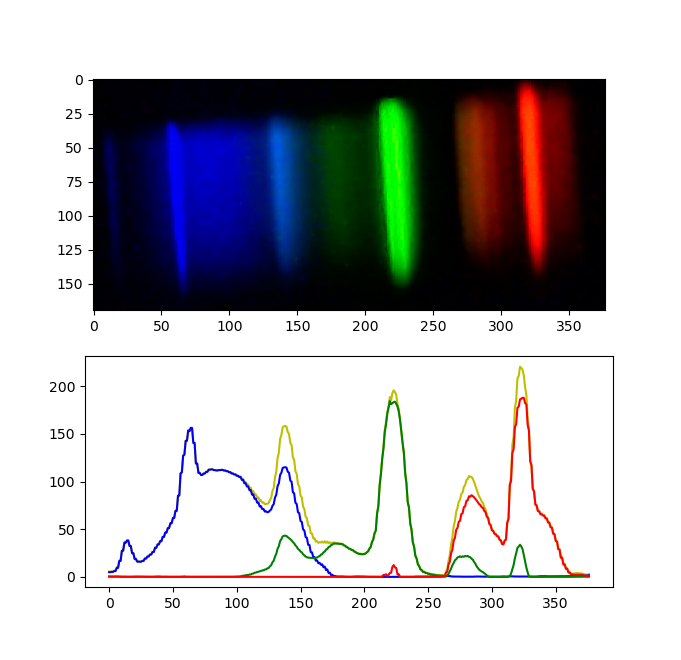
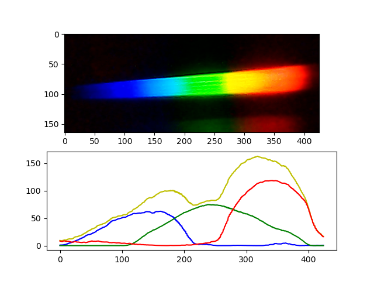
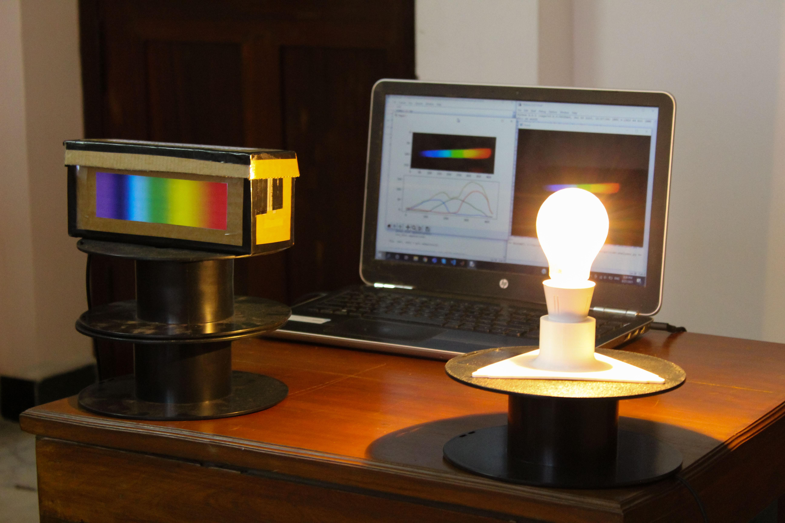

# DIY Spectrometer Analyser
Spectrometer Analyser app using python and opencv developed for a low-cost, scratch-built spectrometer.

In this project, I develop a basic app to extract the intensity distribution of wavelengths emanating from a light source that we would like to study. This is a complement for the low-cost scratch-built spectrometer I designed and built. Detailed build instructions can be found at the following link: [https://www.instructables.com/DIY-Low-Cost-Spectrometer/](https://www.instructables.com/DIY-Low-Cost-Spectrometer/). 

A picture of the result is attached below.



## About The Project
The basic concept of a spectrometer is that an "unknown" beam of light is flashed onto an optical element that splits the beam of light based on the wavelengths present in the "unknown" beam of light. Each wavelength is deviated a different amount, therefore by measuring the deviation, one can determine the wavelengths present in the "unknown" beam of light, which could potentially provide more information about the source of the beam of light, even if it originated millions of kilometers away.

In earlier times, scientists used prisms to split the beam of light into its components, and a pivoting eyepiece to measure the angular deviation of each wavelength component. However, more recently, the prism is replaced by a diffraction grating that serves the same purpose as the prism, and the eyepiece is replaced by an electronic photoreceptor array that is connected to a computer. 

## Getting Started

### Prerequisites
* The program was created using **Python3.7**
* OpenCV
* Matplotlib

### Installation
To install the Spectrometer Analyser app, install the required librarires and clone this repository using the following commands:

```
pip install opencv-python
pip install matplotlib
git clone https://github.com/kousheekc/DIY-Spectrometer-Analyser.git
```

## Usage
To run the app, open a terminal and navigate to the folder you just cloned and run the following command:
```
python3 analyser.py
```
Once the app is running you should see a window with the video stream from the photoreceptor.

To make an analysis, here are the steps to follow:
* Flash the spectrometer with a source of light
* Use the **R** key to crop the image
* Use the **S** key to get the intensity graph
* Use the **Q** key to quit the app

## License
Distributed under the MIT License. See [LICENSE](LICENSE) for more information.

## Contact
Kousheek Chakraborty - kousheekc@gmail.com

Project Link: [https://github.com/kousheekc/DIY-Spectrometer-Analyser](https://github.com/kousheekc/DIY-Spectrometer-Analyser)


### Analysis 1


### Analysis 2



### Overview of System


